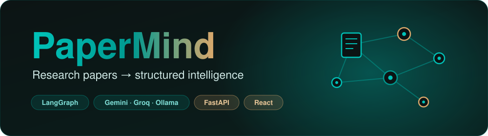
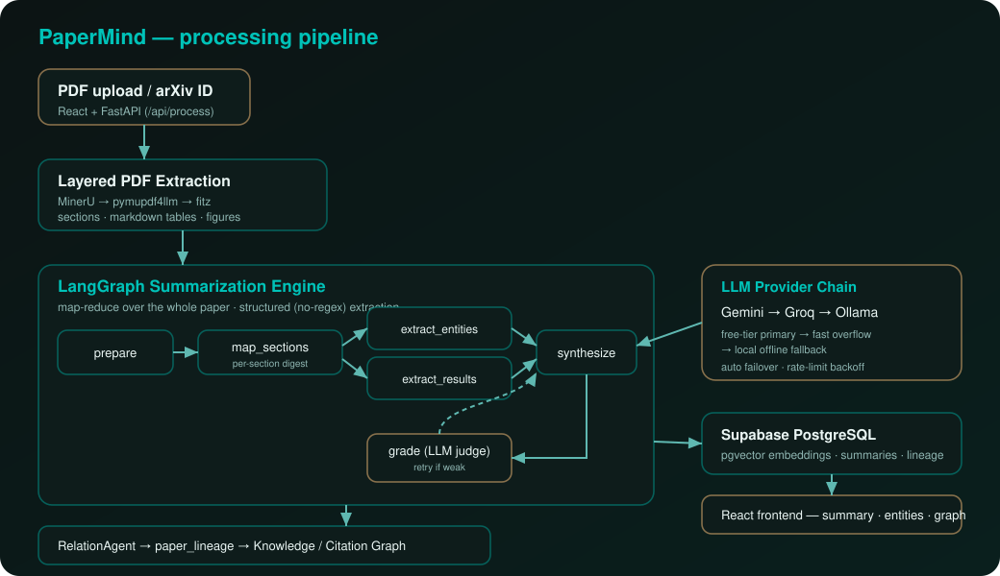

<div align="center">



<br/>

[](https://reactjs.org/)
[](https://fastapi.tiangolo.com/)
[](https://langchain-ai.github.io/langgraph/)
[](https://supabase.com/)
[](#-llm-provider-chain)
[](LICENSE)

**Turn academic PDFs into faithful, structured intelligence — full-paper summaries, typed entities, results tables, and a knowledge graph of how papers relate.**

</div>

---

## 📖 Table of Contents

- [Overview](#-overview)
- [What makes it different](#-what-makes-it-different)
- [Architecture](#️-architecture)
- [The summarization engine](#-the-summarization-engine)
- [LLM provider chain](#-llm-provider-chain)
- [Quick start](#-quick-start)
- [Configuration](#️-configuration)
- [API reference](#-api-reference)
- [Deployment](#-deployment)
- [Project structure](#-project-structure)
- [Contributing](#-contributing)
- [License](#-license)

---

## 🌟 Overview

**PaperMind** turns research papers into structured, trustworthy insight. Upload a PDF or paste an arXiv ID and it reads the **whole** paper through a [LangGraph](https://langchain-ai.github.io/langgraph/) map-reduce pipeline, then returns:

- 📝 a **comprehensive summary** grounded in the full text (not just the abstract)
- 🔑 **key findings, contributions, limitations & future work**
- 🧬 **domain-agnostic typed entities** — *methods · materials · measurements · tools* (works for biomedicine, physics, ML… not just CS)
- 📊 a **quantitative results table** extracted from prose *and* real PDF tables
- 🧾 **per-section digests**
- 🕸️ a **knowledge graph** linking papers by AI-derived relationships (extends / replicates / contradicts / shares-method …)

It runs entirely on **free LLM tiers** (Gemini → Groq) with a **local Ollama** fallback, so there are no API costs to get started.

---

## ✨ What makes it different

Most summarizers paste an abstract into one prompt. PaperMind is built like a production AI system:

| | Old approach | PaperMind |
|---|---|---|
| **Coverage** | abstract + first ~1k tokens | map-reduce over **every section** |
| **Extraction** | hard-coded ML regex (BERT, ImageNet…) | **LLM structured output**, domain-agnostic |
| **Results** | regex over text | LLM over **prose + extracted markdown tables** |
| **Quality control** | none | **LLM-as-judge grade** with a retry loop |
| **Reliability** | single model | **Gemini → Groq → Ollama** auto-failover |
| **Relations** | cosine similarity number | **RelationAgent** explains *how* papers relate |

---

## 🏗️ Architecture

<div align="center">

</div>

```
React (Vite)  ──/api──▶  FastAPI  ──▶  LangGraph engine  ──▶  Supabase (pgvector)
                                          │
                            Gemini → Groq → Ollama (auto-failover)
```

---

## 🧠 The summarization engine

The engine ([`core/graph/summary_graph.py`](core/graph/summary_graph.py)) is a LangGraph `StateGraph`:

```
START → prepare → map_sections ─┬─▶ extract_entities ─┐
                                └─▶ extract_results  ──┴─▶ synthesize → grade ──▶ END
                                                                          └──(retry if weak)
```

1. **prepare** — order & clean sections, pick chunks to map over.
2. **map_sections** — summarize **every** meaningful section concurrently (fast tier).
3. **extract_entities / extract_results** — typed JSON via `with_structured_output` (Pydantic schemas in [`core/graph/schemas.py`](core/graph/schemas.py)). No regex.
4. **synthesize** — final 300–450-word summary + findings/contributions/limitations/future-work (smart tier).
5. **grade** — an LLM judge scores faithfulness & specificity; a weak result loops back once.

Enable it with `PAPERMIND_USE_GRAPH=1` (it falls back to the legacy path on error). Free-tier rate limits are absorbed by a concurrency semaphore + exponential-backoff retries.

**RelationAgent** ([`core/graph/relation_agent.py`](core/graph/relation_agent.py)) labels how papers relate and writes typed edges into `paper_lineage`, which the knowledge-graph endpoints render.

---

## 🔌 LLM provider chain

A single env-driven chain, defined in [`core/llm/providers.py`](core/llm/providers.py):

| Provider | Role | Why |
|----------|------|-----|
| **Gemini** (`gemini-2.0-flash`) | primary | most generous free tier |
| **Groq** (`llama-3.3-70b` / `llama-3.1-8b-instant`) | overflow | ultra-fast, free |
| **Ollama** (`qwen2.5:7b`/`3b`) | offline fallback | private, $0, runs locally |

`PAPERMIND_LLM_PROVIDER=auto` orders by available keys; a named provider becomes primary with the rest as fallbacks. On a failure or rate-limit the chain cascades automatically.

> **Local model sizing (e.g. RTX 2050, 4 GB):** `qwen2.5:3b` runs fully on-GPU; `qwen2.5:7b-instruct-q4_K_M` (~4.5 GB) is the practical ceiling and spills a few layers to CPU. The 7B is markedly more reliable at structured extraction.

---

## 🚀 Quick start

### Prerequisites
- Python 3.10+ · Node.js 18+
- A free [Supabase](https://supabase.com) project
- A free LLM key — [Google AI Studio](https://aistudio.google.com/apikey) (Gemini) and/or [Groq](https://console.groq.com) — **or** [Ollama](https://ollama.com) for fully local

### 1 — Backend

```bash
cd backend
python -m venv research
# Windows: .\research\Scripts\Activate.ps1   |   macOS/Linux: source research/bin/activate
pip install -r ../requirements.txt -r requirements.txt
cp .env.example .env        # then fill in the values (see Configuration)
uvicorn main_app:app --reload --port 8000
```

### 2 — Database
Run the SQL in [`backend/database/`](backend/database/) via the Supabase SQL editor, in order:
`schema.sql` → `experience_schema.sql` → `migrations/001` … `migrations/009`.

### 3 — Frontend

```bash
cd frontend
npm install
npm run dev      # http://localhost:3000  (proxies /api → :8000)
```

### 4 — (optional) Local LLM

```bash
ollama pull qwen2.5:3b        # fast tier
ollama pull qwen2.5:7b-instruct-q4_K_M   # better quality
ollama serve
```

---

## ⚙️ Configuration

Key `backend/.env` values (full list in [`.env.example`](backend/.env.example)):

```env
# Supabase
SUPABASE_URL=...
SUPABASE_SERVICE_KEY=...
JWT_SECRET_KEY=<64-char-random>

# Summarization engine
PAPERMIND_USE_GRAPH=1                 # turn on the LangGraph engine
PAPERMIND_LLM_PROVIDER=auto           # gemini | groq | ollama | auto

# Free LLM keys (use either / both; Ollama needs none)
GOOGLE_API_KEY=...                    # Gemini  (recommended primary)
GROQ_API_KEY=gsk_...                  # Groq

# Free-tier safety
PAPERMIND_LLM_CONCURRENCY=2           # cap simultaneous calls
PAPERMIND_LLM_MAX_RETRIES=6           # backoff retries for 429s
```

> ⚠️ Groq's free tier is **per-account** (≈6k tokens/min, shared across all users), so it won't scale to a multi-user deployment on its own — set `GOOGLE_API_KEY` to make **Gemini** the primary for hosted use.

---

## 📡 API reference

All authenticated routes take `Authorization: Bearer <jwt>`. Interactive docs at `/api/docs`.

| Method | Endpoint | Description |
|--------|----------|-------------|
| `POST` | `/api/auth/register` · `/login` · `GET /me` | Auth |
| `POST` | `/api/process/upload` · `/api/process/arxiv` | Process a paper |
| `GET`  | `/api/summaries` · `/api/summaries/{id}` | List / fetch summaries |
| `GET`  | `/api/graph/paper/{id}` · `/recommendations/{id}` | Per-paper graph |
| `GET`  | `/api/corpus/citation-network` · `/author-graph` | Corpus graphs |
| `POST` | `/api/corpus/relate-papers` | **Run RelationAgent across the library** |
| `GET`  | `/api/health` | Dependency + LLM provider health |

---

## 🚢 Deployment

Designed to run free across three services:

| Layer | Host | Notes |
|-------|------|-------|
| Frontend | **Vercel** | `npm run build`, output `dist/` |
| Backend | **Render** | `uvicorn main_app:app --host 0.0.0.0 --port $PORT` |
| Database | **Supabase** | managed Postgres + pgvector |
| LLM | **Gemini/Groq** free tiers | no GPU needed in the cloud |

Point the frontend at the backend and restrict CORS to your deployed origin in [`backend/main_app.py`](backend/main_app.py).

---

## 📁 Project structure

```
PaperMind/
├── backend/
│   ├── main_app.py            # FastAPI app (routers, health, CORS)
│   ├── routes/                # process_paper, summaries, corpus, graph, …
│   ├── auth/                  # JWT auth + dependencies
│   └── database/migrations/   # 001 … 009 (run in order)
├── core/
│   ├── graph/                 # ⭐ LangGraph engine
│   │   ├── summary_graph.py   #   map-reduce StateGraph
│   │   ├── schemas.py         #   domain-agnostic Pydantic schemas
│   │   ├── relation_agent.py  #   paper-to-paper RelationAgent
│   │   └── adapter.py         #   legacy-format adapter
│   ├── llm/providers.py       # Gemini→Groq→Ollama chain
│   ├── agents/                # orchestrator + extraction agents
│   ├── knowledge/             # graph, citations, semantic scholar
│   └── pipeline/pdf_extractor.py  # MinerU → pymupdf4llm → fitz
├── frontend/src/              # React (pages, components, contexts)
└── docs/assets/              # banner.svg · architecture.svg
```

---

## 🤝 Contributing

1. Fork & branch (`git checkout -b feature/x`)
2. Keep Python PEP-8, run the frontend build (`npm run build`) before PRs
3. Conventional commits (`feat:`, `fix:`, `docs:`)
4. Open a PR describing the change

---

## 📄 License

MIT — see [LICENSE](LICENSE).

---

<div align="center">

**Built by [@SanyamWadhwa07](https://github.com/SanyamWadhwa07)** · powered by LangGraph + free LLM tiers

[⬆ Back to top](#-table-of-contents)

</div>
